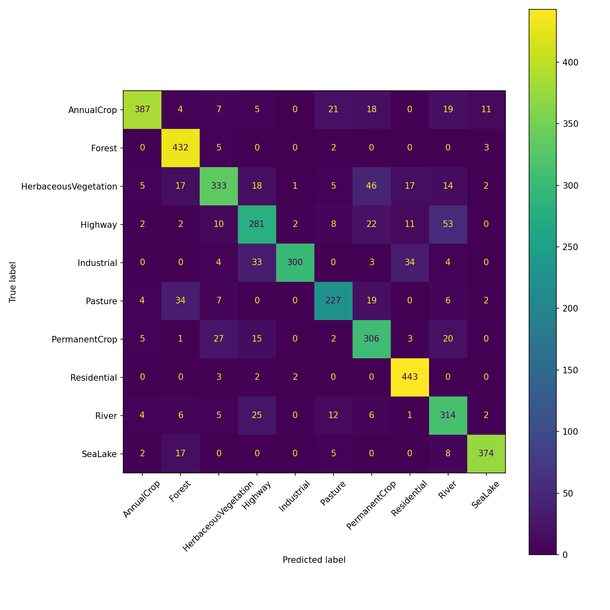

# Sentinel-2 Land-Cover Classification with a CNN (PyTorch)

Classifying Sentinel-2 satellite imagery into 10 land-cover classes using deep learning. This project compares a CNN built from scratch against a fine-tuned ResNet-18, demonstrating the impact of transfer learning on Earth-observation data.

## Overview

Land-cover classification is a core task in remote sensing, supporting urban planning, environmental monitoring, and climate-resilience work. This project trains convolutional neural networks to assign each 64×64 Sentinel-2 image patch to one of 10 land-cover types.

## Dataset

[EuroSAT](https://github.com/phelber/EuroSAT) — 27,000 labelled Sentinel-2 image patches (64×64 px, RGB), across 10 classes: AnnualCrop, Forest, HerbaceousVegetation, Highway, Industrial, Pasture, PermanentCrop, Residential, River, and SeaLake. The dataset is mildly imbalanced, ranging from 2,000 (Pasture) to 3,000 images per class.

## Method

- **Data split:** 70% train / 15% validation / 15% test (reproducible, seeded).
- **Preprocessing:** tensor conversion and normalisation.
- **Baseline model:** a small CNN built from scratch (two convolutional layers + max-pooling + two fully-connected layers).
- **Improved model:** ResNet-18 pre-trained on ImageNet, fine-tuned on EuroSAT (transfer learning), with the final layer replaced to output 10 classes.
- **Training:** CrossEntropyLoss, Adam optimiser, 8 epochs each.

## Results

| Model | Test Accuracy |
|-------|--------------|
| Small CNN (from scratch) | 83.9% |
| Fine-tuned ResNet-18 | 96.6% |

Transfer learning improved test accuracy by 12.7 percentage points.

### Confusion analysis

The most common misclassification was **Highway predicted as River** (53 cases), reflecting that both appear as thin, dark, linear features at Sentinel-2's 10 m resolution. Vegetation classes (HerbaceousVegetation, PermanentCrop, Pasture) were also mutually confused due to spectral similarity — sensible errors that mirror the challenges a human photo-interpreter faces.

## How to Run

Open the notebook in Google Colab (enable a GPU runtime), and run the cells top to bottom. The EuroSAT dataset downloads automatically via torchvision.

## What I Learned

This was my first deep-learning project. I learned how to load and inspect satellite imagery as tensors, build a CNN from scratch and understand each layer, write a training loop, evaluate honestly on a held-out test set, read a confusion matrix to diagnose model errors, and apply transfer learning to substantially improve performance.

## Tech Stack

Python, PyTorch, torchvision, scikit-learn, Matplotlib, NumPy.
